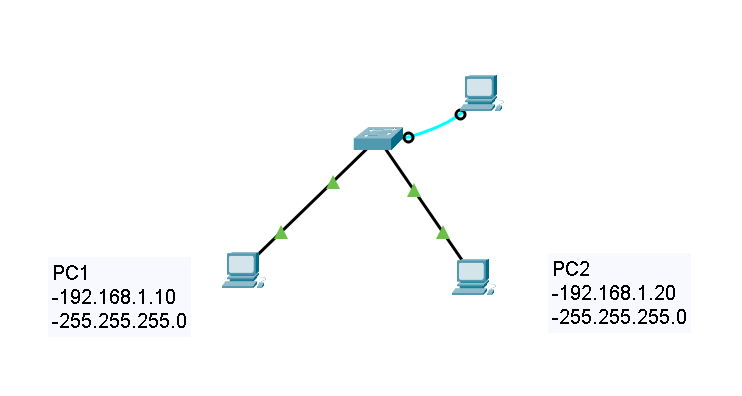

# Small Office Network Deployment (Basic LAN + Switch Management)

## Objective

Deploy a small office network with two end devices connected through a Layer 2 switch, configure basic management access and SSH connectivity, and verify network communication.

---

## Topology

Two PCs connected to a Cisco 2960 switch.

---

## Devices Used

* Cisco 2960 Switch
* 2 PCs
* Ethernet cables

---

## IP Addressing

| Device       | IP Address   | Subnet Mask   |
| ------------ | ------------ | ------------- |
| PC1          | 192.168.1.10 | 255.255.255.0 |
| PC2          | 192.168.1.20 | 255.255.255.0 |
| Switch (SVI) | 192.168.1.2  | 255.255.255.0 |

---

## Configuration Summary

* End devices were configured within the same subnet (192.168.1.0/24).
* A management IP address was assigned to the switch (SVI - VLAN 1).
* Basic access security was configured on the console line.
* The switch was prepared for secure remote management using SSH.

---

## Verification

### Connectivity Test

A ping was performed between PC1 and PC2.

**Result:** Successful communication.

---

### Switch Management Access

The switch was successfully reachable using its management IP address (192.168.1.2), using SSH with the configured admin credentials.

---

### MAC Address Table

The switch dynamically learned MAC addresses and associated them with the correct ports.

---

## Troubleshooting Scenario

### Issue

PC2 was moved to a different subnet:

* 192.168.2.20

### Result

Communication failed.

### Analysis

Devices in different subnets require a Layer 3 device (router) for communication.

---

## Key Concepts Learned

* Layer 2 switching
* MAC address learning
* Switch management using SVI
* Basic network segmentation concepts
* Troubleshooting connectivity issues

---

## Skills Demonstrated

* IP addressing
* Basic network configuration
* Switch management setup
* Connectivity verification
* Troubleshooting

---

## Conclusion

This lab demonstrates the deployment of a basic LAN and introduces switch management and secure remote access using SSH, highlighting the limitations of Layer 2 communication and the need for routing between networks.

## Real-World Application
This configuration simulates a small office environment where secure remote access to network devices is required for administration and monitoring.
