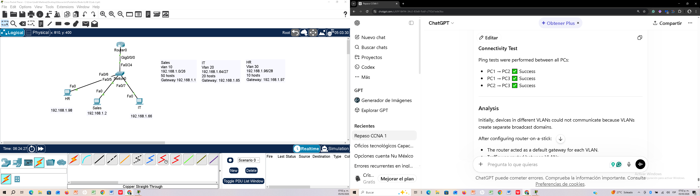

# Lab 2 – VLAN Segmentation and Inter-VLAN Routing

## Objective
Design and implement VLAN segmentation in a small office network and enable communication between departments using inter-VLAN routing (Router-on-a-Stick).

_______________________________________
## Scenario
A company requires network segmentation to improve security and performance. Each department must be placed in its own VLAN, but communication between departments must be allowed through a router.
Departments:
•	Sales
•	IT
•	HR
________________________________________
## Topology
Three PCs connected to a Layer 2 switch, which is connected to a router using a trunk link.
 

________________________________________
## Devices Used
•	Cisco 2960 Switch
•	Router 4331 (Router-on-a-Stick configuration)
•	3 PCs
•	Ethernet cables
________________________________________
## VLAN Configuration
VLAN ID	Name	Department
10	Sales	Sales
20	IT	IT
30	HR	HR
________________________________________
## IP Addressing
Device	VLAN  Hosts	IP Address	  Subnet Mask	     Default Gateway
PC1	     10	   50	192.168.1.2	  255.255.255.192	 192.168.1.1
PC2	     20	   20	192.168.1.66  255.255.255.224	 192.168.1.65
PC3	     30	   10	192.168.1.98  255.255.255.240	 192.168.1.97
________________________________________
## Configuration Summary
•	VLANs were created by VLSM.
•	Switch ports were configured as access ports and assigned to the corresponding VLAN.
•	A trunk link was configured between the switch and the router.
•	Router subinterfaces were created for each VLAN.
•	Inter-VLAN routing was enabled.
________________________________________
### Key Configuration
Switch Configuration
Create VLANs
vlan 10
name Sales

vlan 20
name IT

vlan 30
name HR
________________________________________
Assign Access Ports
interface fa0/5
switchport mode access
switchport access vlan 10

interface fa0/7
switchport mode access
switchport access vlan 20

interface fa0/6
switchport mode access
switchport access vlan 30
________________________________________
Configure Trunk Port (to Router)
interface fa0/24
switchport mode trunk
________________________________________
Router Configuration (Router-on-a-Stick)
interface g0/0
no shutdown
________________________________________
VLAN 10
interface g0/0/0.10
encapsulation dot1Q 10
ip address 192.168.1.1 255.255.255.192
________________________________________
VLAN 20
interface g0/0.20
encapsulation dot1Q 20
ip address 192.168.1.65 255.255.255.224
________________________________________
VLAN 30
interface g0/0.30
encapsulation dot1Q 30
ip address 192.168.1.96 255.255.255.240
________________________________________
## Verification
VLAN Table
show vlan brief
________________________________________
## Trunk Verification
show interfaces trunk
________________________________________
## Connectivity Test
Ping tests were performed between all PCs:
•	PC1 → PC2 ✅ Success
•	PC1 → PC3 ✅ Success
•	PC2 → PC3 ✅ Success
________________________________________
## Analysis
Initially, devices in different VLANs could not communicate because VLANs create separate broadcast domains.
After configuring router-on-a-stick:
•	The router acted as a default gateway for each VLAN.
•	Traffic was routed between VLANs.
•	Communication between departments was successfully established.
________________________________________
## Key Concepts Learned
•	VLAN segmentation
•	VLSM technique
•	Trunking (802.1Q)
•	Inter-VLAN routing
•	Router-on-a-stick configuration
•	Default gateway role
________________________________________
## Skills Demonstrated
•	VLAN configuration
•	VLSM subneting
•	Trunk configuration
•	Router subinterface configuration
•	IP addressing
•	Network troubleshooting
•	Inter-VLAN communication
________________________________________
## Conclusion
This lab demonstrates how VLAN segmentation and inter-VLAN routing work together to create a structured and scalable network. It highlights the importance of trunk links and router configuration to enable communication between logically separated networks.

