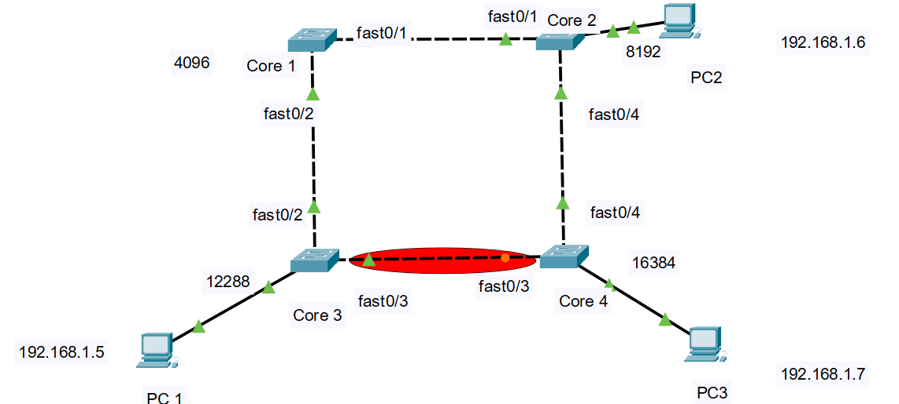

[readme.md](https://github.com/user-attachments/files/28074113/readme.md)
# Lab 03 — Spanning Tree Protocol (STP)

## Objective
Observe how STP elects a Root Bridge, blocks redundant ports, 
and reconverges when a link goes down.

## Topology
- 4x Cisco Catalyst 2960 Switch
- 3x PC

## Tools used
- Cisco Packet Tracert 9.0.0

## Addressing
| Device | IP Address    | Subnet Mask   |
|--------|---------------|---------------|
| PC1    | 192.168.1.5   | 255.255.255.0 |
| PC2    | 192.168.1.6   | 255.255.255.0 |
| PC3    | 192.168.1.7   | 255.255.255.0 |

## Configuration
- Set Switch1 as Root Bridge by lowering priority to 4096
- Set Switch2 with the priority 8192
- Set Switch3 with the priority 12288
- Set Switch4 with the priority 16384
- STP automatically blocked one redundant port

## Tasks Performed
1. Verified Root Bridge election with `show spanning-tree`
2. STP automatically blocked the switch 4 Fa0/3
3. Confirmed end-to-end connectivity with ping from PC1 to PC2
4. Shutdown the active uplink on Switch1 to simulate a failure
5. Observed STP reconvergence — blocked port transitioned to forwarding
6. Verified ping still works through the alternate path

## Key Commands
....
show spanning-tree
show spanning-tree vlan 1
shutdown / no shutdown
...

## Lessons Learned
STP prevents Layer 2 loops by blocking redundant links. 
When the active path fails, the blocked port transitions to 
forwarding after the reconvergence timer (~30 seconds with 
classic STP, ~1-2 seconds with RSTP).
