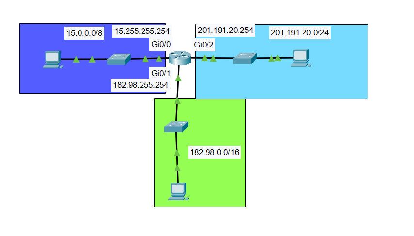

# Lab: Conectividad entre redes con direcciones IP de distinta clase. 

## Descripción general:
Este laboratorio práctico tiene como objetivo abordar una conectividad entre una PC con una dirección de clase A, con una de clase B y una de clase C. Es fundamental en este tipo de laboratorios que el prefijo y la máscara de subred estén bien configurados para evitar errores al momento de diseñar las gateways.

## Topología de red:

## Tabla de direccionamiento IP:
Dispositivo | Interfaz | Dirección IP | Máscara de Subred | Clase IPv4 | Gateway por Defecto | 
| **PC-A** | FastEth0    | 15.0.0.1  |      255.0.0.0 (/8)|  Clase A   | 15.255.255.254 | 
| **PC-B** | FastEth0    | 182.98.0.1 | 255.255.0.0 (/16) | Clase B    | 182.98.255.254 | 
| **PC-C** | FastEth0    | 201.191.20.1 | 255.255.255.0 (/24)| Clase C | 201.191.20.254 | 
| **R1**   | GigabitEth0/0 | 15.255.255.254 | 255.0.0.0 (/8) |   Clase A   | N/A | 
| **R1**   | GigabitEth0/1 | 182.98.255.254 | 255.255.0.0 (/16) |   Clase B   | N/A | 
| **R1**   | GigabitEth0/2 | 201.191.20.254 | 255.255.255.0 (/24) |  Clase C  | N/A | 

## Objetivos del laboratorio
1. Configurar interfaces de red y verificar el direccionamiento IP en cada host. 
2. Configurar enrutamiento L3 para permitir la comunicación inter-red. 
3. Validar la conectividad mediante pruebas ICMP (`ping`) y trazado de rutas (`traceroute`).

## Configuración de dispositivos de red:
R1# configure terminal
R1(config)# interface gigabitEthernet0/0
R1(config-if)# ip address 15.255.255.254 255.0.0.0
R1(config-if)# description “Class A address”
R1(config-if)# no shutdown
R1(config-if)# exit

R1(config)# interface gigabitEthernet0/1
R1(config-if)# ip address 182.98.255.254 255.255.0.0
R1(config-if)# description “Class B address”
R1(config-if)# no shutdown
R1(config-if)# exit

R1(config)# interface gigabitEthernet0/2
R1(config-if)# ip address 201.191.20.254 255.255.255.0
R1(config-if)# description “Class C address”
R1(config-if)# no shutdown
R1(config-if)# end

## Pruebas de verificación y resultados:
•	Sin router configurado: al hacer un ping este da como resultado “Request time out” porque los hosts pertenecen a dominios de difusión distintos.
•	Con router configurado: al hacer ping no se pierde ningún ICMP porque el default Gateway permite la salida y entrada de datos entre diferentes LANs. 

PC-A > ping 182.98.0.1

Pinging 182.98.0.1 with 32 bytes of data:

Request timed out.
Reply from 182.98.0.1: bytes=32 time<1ms TTL=127
Reply from 182.98.0.1: bytes=32 time<1ms TTL=127
Reply from 182.98.0.1: bytes=32 time<1ms TTL=127

Ping statistics for 182.98.0.1:
Packets: Sent = 4, Received = 3, Lost = 1 (25% loss)

PC-A > tracert 182.98.0.1

Tracing route to 182.98.0.1 over a maximum of 30 hops: 

1 0 ms 0 ms 0 ms 15.255.255.254
2 0 ms 0 ms 0 ms 182.98.0.1

Trace complete.

## Conclusiones y Aprendizajes Clave
•	Estructura IPv4: Se reafirmó la diferencia conceptual entre las máscaras de red por defecto para Clases A, B y C.
•	Enrutamiento Necesario: Se comprobó que sin un elemento de Capa 3 no es posible el intercambio de paquetes entre direcciones IP de bloques lógicos distintos, aun estando en el mismo medio físico.
