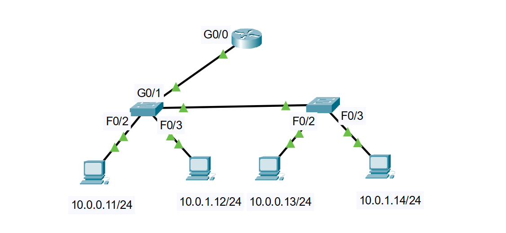

# Dia 05: Pequeña Red Inter-VLAN con Router-on-a-Stick y Seguridad de Capa 2

## Objetivo:
Implementar y configurar una red LAN segmentada en 2 VLANs utilizando el esquema **Router-on-a-Stick** para la comunicación Inter-VLAN. Asimismo, aplicar políticas de seguridad en Capa 2 que incluyan hardening básico de dispositivos (contraseñas de consola y modo EXEC privilegiado, cifrado de credenciales, desactivación de interfaces sin uso y CDP), junto con la implementación de **Port Security** en puertos de acceso.

## Topología:

## Dispositivos usuarios:
4 PC de escritorio
2 switch 2960
1 router 2901

## Referencia de comandos:
'''text
! Cambio de nombre del dispositivo
hostname Sw-1

! Desactivar la búsqueda DNS al ingresar comandos erróneos en la CLI
no ip domain-lookup

! Mensaje de advertencia al acceder a la consola del switch
banner motd "Access denied. Authorized personnel only."

! Contraseña cifrada para acceder al modo EXEC privilegiado
enable secret CCNA

! Cifrado de contraseñas guardadas en texto plano dentro de la configuración
service password-encryption

! Configuración de autenticación para el acceso por puerto de consola
line console 0
 password cisco
 login

! Creación de la VLAN 13
vlan 13
 name Gerencia

! Configuración del puerto de acceso asignado a la VLAN 13
interface FastEthernet0/2
 description Conexión a PC-1 (Gerencia)
 switchport mode access
 switchport access vlan 13

 ! Configuración de la interfaz como enlace troncal 802.1Q
interface FastEthernet0/1
 description Enlace Troncal hacia Router/Switch
 switchport mode trunk
 switchport trunk allowed vlan 13,24
 switchport trunk native vlan 1

! Activación y configuración de Port Security en puerto de acceso
interface FastEthernet0/2
 switchport port-security
 switchport port-security mac-address sticky
 switchport port-security violation restrict

 ! Configuración de subinterfaz en el router con encapsulación 802.1Q
interface GigabitEthernet0/0.13
 description Subinterfaz Gateway VLAN 13
 encapsulation dot1Q 13
 ip address 10.0.0.1 255.255.255.0

 ! Desactivación masiva de interfaces no utilizadas y de CDP por seguridad
interface range FastEthernet0/4 - 24
 shutdown
 no cdp enable

 ! Verificación de estados, tablas y configuraciones activas
show running-config
show port-security
show interfaces FastEthernet0/1
show cdp neighbors
show vlan brief
show ip interface brief

! Guardar cambios en la NVRAM
write memory

## Habilidades demostradas:
Segmentación de red mediante VLANs (IEEE 802.1Q).

Enrutamiento Inter-VLAN mediante Router-on-a-Stick.

Configuración de enlaces Troncales (Trunk), de acceso y asignación de VLAN Nativa.

Implementación de Port Security (MAC Sticky y Violation Restrict).

Desactivación de servicios y puertos para Hardening de Capa 2.

Inspección de vecinos mediante CDP y verificación con comandos show.
